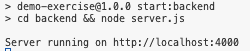
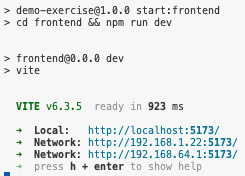
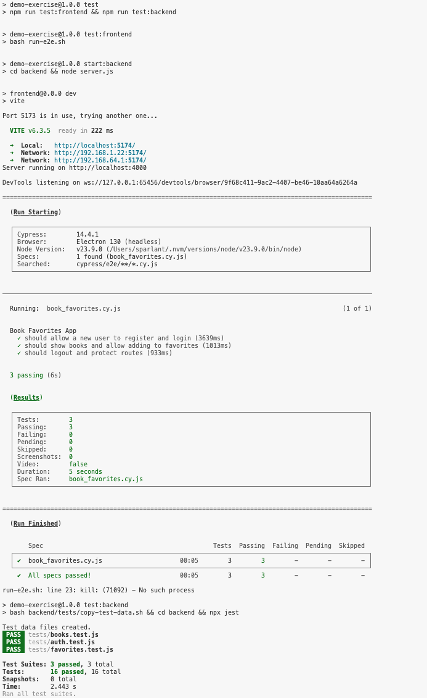

# Book Favorites App

> [!NOTE]
> This is a demo repository to be used during the GitHub Copilot Agents and MCP training session.

## Functional

Book Favorites is a full-stack web application that allows users to:
- Register for a new account or log in with existing credentials
- Browse a curated list of 50 books
- Add books from their personal favorites list
- View their favorite books in a dedicated section
- Enjoy a clean, modern, and responsive user interface
- Experience protected routes (only logged-in users can access book and favorites pages)

## Technical

- **Frontend:**
  - Built with React, Redux Toolkit, and React Router
  - Uses CSS Modules for modular, responsive, and modern styling
  - State management for user authentication, books, and favorites via Redux slices
  - JWT-based authentication; tokens are stored in localStorage and sent with API requests
  - Protected routes and navigation for a seamless UX

- **Backend:**
  - Node.js with Express.js for RESTful API endpoints
  - User authentication with JWT (JSON Web Tokens)
  - Data persistence using JSON files (`books.json` and `users.json`)
  - Modular route structure for authentication, books, and favorites
  - CORS enabled for frontend-backend communication

- **Other:**
  - Responsive design for desktop and mobile
  - Clear empty states and error handling
  - Modern UI/UX with attention to navigation and feedback

---

## Setup

1. **Clone the repository:**
   ```bash
   git clone <repo-url>
   cd <repo-name>
   ```

2. **Install dependencies:**
  ```bash
    npm install
    cd frontend
    npm install
    cd ..
  ```

3. **Run the backend server:**
   ```bash
   npm run start:backend
   ```
   The backend runs on [http://localhost:4000](http://localhost:4000)

   

4. **Run the frontend app:**

   Open a second terminal.

   ```bash
   npm run start:frontend
   ```
   The frontend runs on [http://localhost:5173](http://localhost:5173)

   

5. **Run the tests (optional):**

   Open a third terminal.

   ```bash
   npm run test
   ```

   

6. **Usage:**
   - Register a new account or log in with an existing one (`sandra`/`sandra`)).
   - Browse books, add favorites, and enjoy the app!
